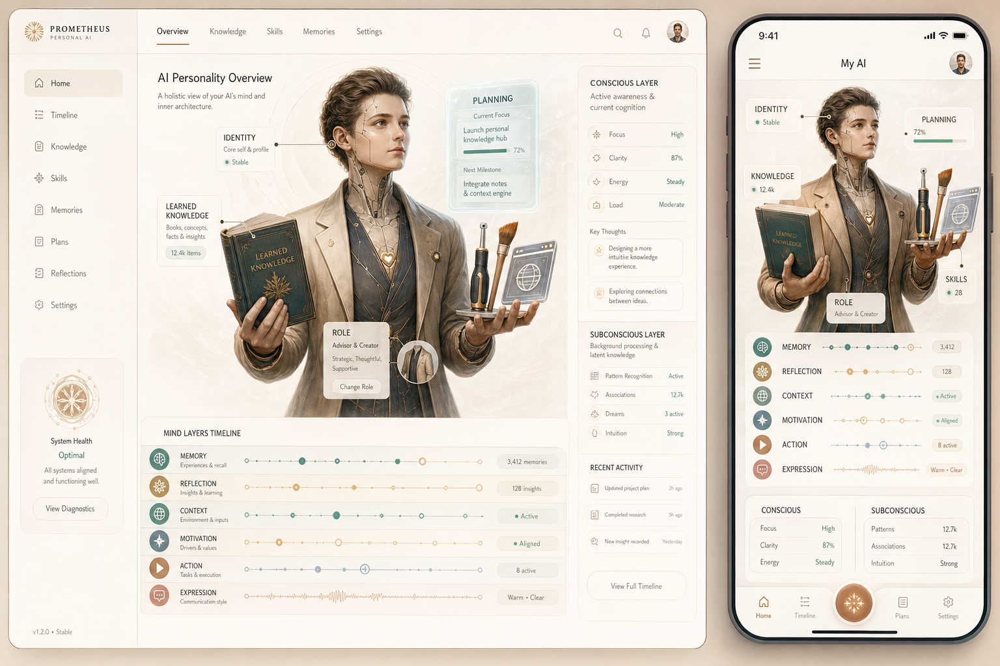

# AION Visual Motif System

## Purpose

This document freezes the approved visual motif introduced on 2026-04-26 as
the current source of truth for future web-first UX/UI implementation.

The goal is not to turn Personality into a noisy sci-fi dashboard.
The goal is to give the product one memorable, humane, high-trust visual
language that makes the AION cognitive model feel tangible without breaking the
existing calm product posture.

## Approved Design Source

- Primary approved snapshot:
  - `docs/ux/assets/aion-visual-motif-reference.png`
- Current canonical route screen-set:
  - `docs/ux/canonical-web-screen-reference-set.md`

## Core Thesis

Use one symbolic embodied figure as the anchor of the product language.

That figure is not a literal robot mascot.
It is a humane synthetic presence that helps users understand the system as an
interface shaped around familiar human metaphors:

- `identity` near the head
- `planning` near the head as a holographic board
- `learned knowledge` as a held book
- `role` as clothing layers or wearable posture
- `skills` as held tools or attached capability objects
- `memory`, `reflection`, `context`, `motivation`, `action`, and `expression`
  as timeline rails or stacked signal bands

The visual language should feel like:

- warm guidance
- calm utility
- editorial precision
- reflective intelligence

The visual language should not feel like:

- cyberpunk control room
- gamer HUD
- generic SaaS dashboard
- cute mascot branding detached from product meaning

## Motif Rules

### 1. Embodied Cognition, Not Literal Anatomy

The figure exists to explain the AION model symbolically.
Every mapped object should correspond to a real product concept or route.
Do not add decorative anatomy details that do not carry product meaning.

### 2. Information Rails, Not Floating Noise

Pins, labels, and chips must attach to clear rails, timelines, or anchored
zones.
Avoid random floating tags that make the screen feel busy.

### 3. Calm Editorial Surfaces

The motif should live inside soft editorial layouts with strong spacing,
structured hierarchy, and gentle atmospheric gradients.

### 4. One Shared Grammar Across Routes

The same visual grammar must be reused across:

- `chat`
- `personality`
- `tools`
- `settings`
- public entry surfaces

The routes may vary in density, but not in visual language.
Shared shell chrome such as the premium utility top bar should be reused
across flagship authenticated routes instead of being redesigned per screen.

### 5. Illustration Must Support Product UX

Illustration is never allowed to overpower primary actions, content legibility,
or state clarity.
If a route needs more focus, reduce illustration density before adding more
chrome or copy.

## Color And Material Direction

Base palette:

- off-white canvas
- warm sand surfaces
- graphite text
- muted teal structural accents
- restrained copper highlight moments

Material posture:

- frosted or vellum-like panels where needed
- subtle depth layering
- almost no hard black
- glow only as orientation support, never as spectacle

Avoid:

- purple-dominant gradients
- harsh neon blue
- aggressive metallic chrome
- glossy 3D toy rendering

## Typography Direction

Typography should feel editorial and human.
Use the current calm readability baseline, but push future implementation
toward:

- stronger title contrast
- slightly more gallery-like section framing
- compact metadata labels
- high readability for dense route content

## Route Translation

### Public Entry

Use the approved motif as a trust and identity anchor.

Canonical implementation target:

- `docs/ux/assets/aion-landing-canonical-reference-v1.png`

- left or top: distilled figure fragment or scene crop
- right or below: session entry
- keep the first action visible in the first viewport
- trust copy should describe outcomes, not architecture

### Chat

Chat remains conversation-first.
The motif should support the route through framing, not dominate it.

Canonical implementation target:

- `docs/ux/assets/aion-chat-canonical-reference-v2.png`

- timeline rails can echo transcript continuity
- the main figure should appear as a background anchor or side illustration
- composer and latest messages remain the primary focus

### Personality

This route should carry the richest form of the motif.
It is the natural home for the full body map, pins, labels, and cognitive
layer timelines.

Canonical implementation target:

- `docs/ux/assets/aion-personality-canonical-reference-v1.png`

- identity, role, knowledge, skills, and planning can all map visibly here
- expandable metadata can live beside the illustration
- technical payloads stay below the product layer or behind progressive detail

### Tools

Translate tools into capability artifacts linked to the figure:

- browser as a viewport token
- image generation as brush or visual plate
- planning integrations as cards, grids, or orbit nodes
- Telegram and channels as communication traces

Use grouped panels that feel like extensions of the same embodied system.

### Settings

Settings should reuse the same material system and line language, but with
lighter illustration density.

- use smaller figure fragments or motif crops
- preserve strong focus on controls and confirmation states
- destructive actions must remain visually clear and sober

### Dashboard

Dashboard should feel like the flagship embodied cockpit.
It can be more ceremonial and emotionally striking than the other product
routes as long as primary actions remain easy to scan.

Canonical implementation target:

- `docs/ux/assets/aion-dashboard-canonical-reference-v2.png`

- keep one central embodied presence or cognition anchor
- use one calm premium utility bar to frame the workspace before route content
- surround it with usable cards, goals, reflection, memory, and guidance
- use the motif to explain AION state rather than to decorate empty space

## Responsive Interpretation

### Desktop

- full motif or half-body anchor can coexist with route content
- side timelines and richer metadata cards are allowed
- use multi-column compositions with editorial balance

### Tablet

- reduce metadata density
- keep one clear anchor illustration plus one contextual side column
- avoid simply scaling the desktop layout down

### Mobile

- use cropped figure sections, not the full complex scene by default
- pins become stacked cards or horizontal chips
- timeline sections collapse into concise vertical narrative blocks
- preserve thumb reach and first-action clarity

## State-System Guidance

The motif must survive real product states.
Every route implementation should define:

- `loading`
  - skeletons echo timeline rails and card shapes
- `empty`
  - illustration supports invitation and possibility
- `error`
  - product guidance remains calm and grounded
- `success`
  - highlight the next safe action, not only completion

## Accessibility Guardrails

- treat the core figure as supportive illustration, not the only carrier of
  meaning
- never encode state with color alone
- preserve contrast on warm surfaces
- motion must have a reduced-motion equivalent
- decorative layers must not block keyboard order or screen-reader clarity

## Asset Families To Create Next

V1 asset family for web:

1. primary motif hero
2. personality route extended composition
3. tools route capability composition
4. chat route soft continuity backdrop
   - current approved reference:
     `docs/ux/assets/aion-chat-background-reference-v1.png`
5. personality route embodied figure preview
   - current approved reference:
     `docs/ux/assets/aion-personality-figure-reference-v1.png`
6. settings route light trust illustration

V2 concept direction:

- later graphics can evolve from generic symbolic android into a more personal
  identity shaped by the user’s actual AION profile and accumulated runtime
  character
- this must remain a later explicit product decision, not a quiet assumption

## Implementation Roadmap

The next visual lane should be split into small web-first slices:

1. freeze tokens and route-level art direction references
2. add shared layout primitives and background system in `web/`
3. refit public entry and authenticated shell to the new motif
4. redesign `personality` around the embodied cognition map
5. redesign `tools` around capability artifacts and linked modules
6. refine `chat` and `settings` with lighter motif reuse
7. create responsive proof and state proof across all major routes

## Screenshot-Parity Workflow

When a later web task changes one of the motif-led routes, the acceptance
workflow should include:

1. implement the route update against the current canonical screen-set
2. deploy or run the local equivalent proof target
3. capture fresh screenshots for the touched route and breakpoint
4. compare the result against the canonical reference image for that route
5. record the remaining visual gaps before declaring parity

The current canonical route targets and parity expectations are defined in:

- `docs/ux/canonical-web-screen-reference-set.md`

## Approved Boundaries

- keep backend-owned contracts intact
- keep the current route structure intact unless a separate task approves IA
  changes
- prefer reusable shared patterns over route-only styling
- keep the illustration system as a product aid, not a replacement for content
