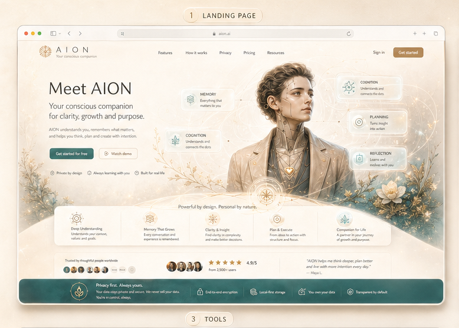
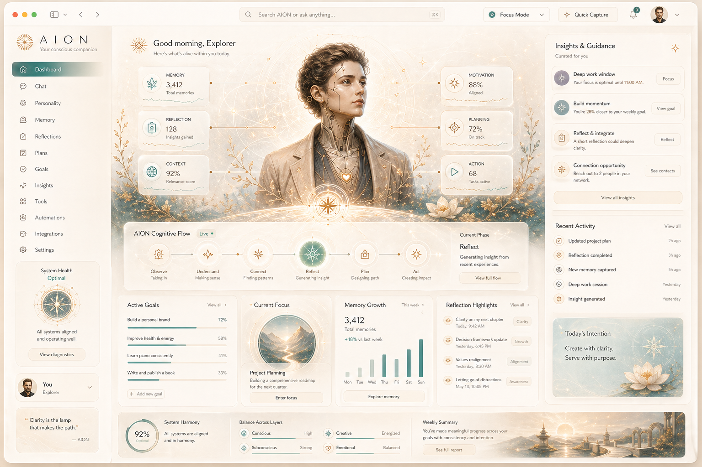
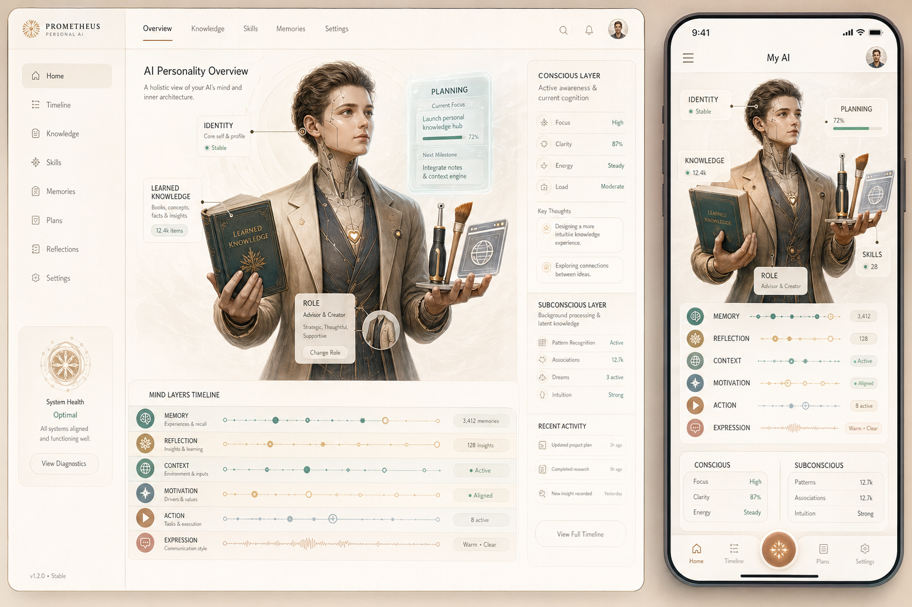

# Canonical Web Screen Reference Set

## Purpose

This document freezes the currently approved web-screen targets for AION.
These images are the canonical visual references for convergence work on the
current web-first product shell.

They do not replace architecture, route contracts, or backend truth.
They define the UX/UI target that future implementation should move toward.

## Approved Canonical Screen Set

### Shared Canonical Persona Figure

- Asset:
  - `docs/ux/assets/aviary-persona-figure-canonical-reference-v1.png`
- Role:
  - shared embodied persona anchor reused across landing, dashboard, chat,
    personality, and future flagship modules
- Must preserve:
  - one humane synthetic identity across routes
  - recognizable book, writing instrument, and luminous interface language
  - module-specific adaptation through crop, callouts, and support objects
  - no route-local replacement with a different humanoid or unrelated mascot

### Authenticated Sidebar Layout

- Asset:
  - `docs/ux/assets/aviary-sidebar-layout-canonical-reference-v1.png`
- Role:
  - canonical left-sidebar target for the authenticated parent layout that
    hosts dashboard, chat, personality, and future module routes
- Must preserve:
  - narrow premium rail proportion with calm vertical rhythm
  - top brand lockup with companion subtitle
  - one soft active-pill selection treatment
  - icon-led primary navigation stack
  - bottom support stack:
    - system health card
    - signed-in identity card
    - aphorism closure card
  - warm editorial material, not enterprise chrome

### Public Landing

- Asset:
  - `docs/ux/assets/aion-landing-canonical-reference-v1.png`
- Role:
  - primary public-entry target for trust, value framing, and visual identity
- Must preserve:
  - luminous editorial warmth
  - immediate first-viewport value proposition
  - strong CTA clarity
  - embodied AION presence as trust anchor
  - premium shell framing without fake browser-window chrome or title-bar
    ornament

### Dashboard

- Asset:
  - `docs/ux/assets/aion-dashboard-canonical-reference-v2.png`
- Implementation support asset:
  - `docs/ux/assets/aviary-dashboard-hero-canonical-reference-v3.png`
- Role:
  - flagship authenticated overview target
- Must preserve:
  - central embodied cognition anchor
  - magical but usable information hierarchy
  - strong guidance, goals, insights, and state readability
  - premium editorial density without collapsing into analytics clutter
  - one continuous scenic hero composition when translated into production
    code, instead of visibly separate figure and atmosphere layers

### Personality

- Asset:
  - `docs/ux/assets/aion-personality-canonical-reference-v1.png`
- Role:
  - richest explanation surface for the AION embodied cognition model
- Must preserve:
  - full symbolic figure
  - anchored labels and cognitive mapping
  - calm explanatory side panels
  - clear distinction between the embodied map and route metadata

### Chat

- Asset:
  - `docs/ux/assets/aion-chat-canonical-reference-v4.png`
- Role:
  - premium conversation target for the main product experience
- Must preserve:
  - conversation-first hierarchy inside the authenticated product shell
  - left navigation, top utility controls, transcript, embodied stage, and
    cognitive context as one composed workspace
  - a strong central AION presence that supports the dialogue without
    displacing the message thread
  - right-column cognitive context with intent, motivation, goal, memory,
    suggested actions, and proactive check-in hierarchy
  - bottom composer with mode tabs, attachments, voice, and send affordance
    integrated into one premium tray

## Route Translation Rules

- all flagship routes should reuse the shared canonical persona figure and
  adapt it to route context before introducing a different embodied being
- `landing` should converge toward the landing reference, not toward the
  dashboard shell.
- `dashboard` should converge toward the dashboard reference even if some
  motifs overlap with `personality`.
- `personality` should remain the richest embodiment route and must not be
  flattened into a generic stats page.
- `chat` should stay calmer than `dashboard`; it must not inherit dashboard
  modules such as process rails unless a real chat-side product function
  explicitly requires them.
- `tools` may borrow structure from the current visual language, but is not
  yet frozen by this canonical set.
- `settings` remains acceptable under the current approved direction, but it
  should still reuse the material, spacing, and trust posture defined by the
  canonical set above.

## Screenshot-Parity Workflow

Every meaningful change to a motif-led web route should use the following
acceptance loop:

1. treat the matching canonical asset as the route target before editing
2. implement the smallest viable route change
3. run the local validation or deploy path required by the touched scope
4. capture fresh screenshots after the route is running
5. compare the screenshot against the canonical reference
6. record what now matches, what still drifts, and what the next smallest gap
   is

## Evidence Expectations

For future UX/UI implementation tasks touching `landing`, `dashboard`,
`personality`, or `chat`, capture parity evidence for:

- `desktop`
- `tablet`
- `mobile` when the route is responsive in scope
- `loading`, `empty`, `error`, and `success` when state work is in scope

Preferred evidence locations:

- `.codex/artifacts/` for working proof and iteration captures
- task notes in `.codex/tasks/`
- `.codex/context/PROJECT_STATE.md` and `.codex/context/TASK_BOARD.md` when the
  accepted baseline changes

## Related Sources Of Truth

- `docs/ux/aion-visual-motif-system.md`
- `docs/ux/design-memory.md`
- `docs/ux/visual-direction-brief.md`
- `docs/ux/screen-quality-checklist.md`
